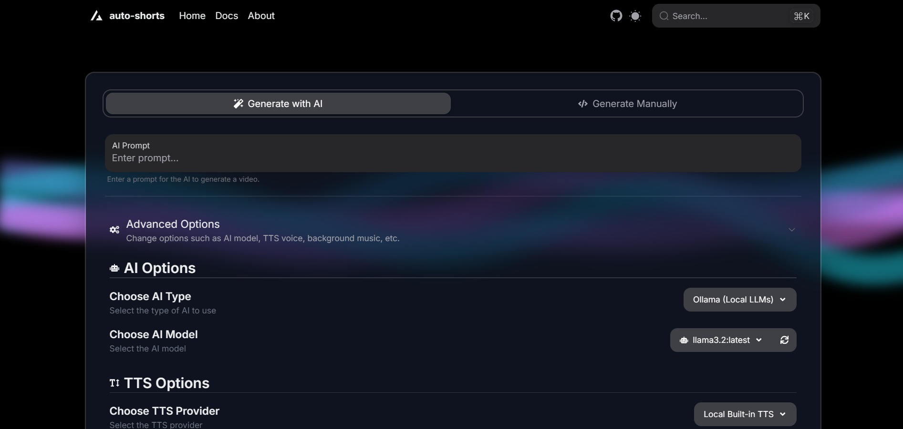
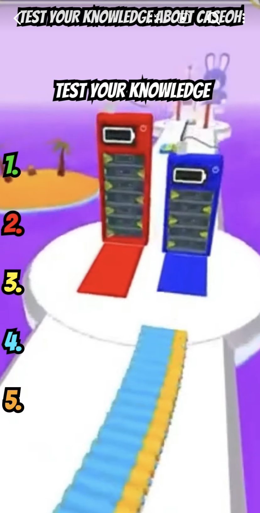
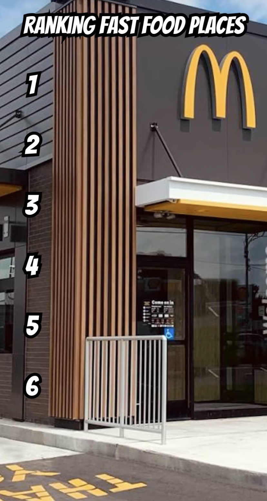

# AutoShorts - AI-powered Shorts Generator

> [!WARNING]
> Unfortunately, I have stopped working on auto-shorts since it was just a learning project for me. I do not have time to continue working on the project. I will keep this project open for minor bug fixes, etc. 

<!-- Badges -->
[](https://alamshafil.github.io/auto-shorts/)
[](https://github.com/alamshafil/auto-shorts/actions/workflows/node.js.yaml)
[](https://discord.gg/wMdjy2NtQy)

AutoShorts is a fully fledged package that generates shorts videos with the help of AI to write the script. It can generate popular types of video seen on YouTube Shorts and TikTok. However, there is a goal of making it more general and customizable to generate different types of videos for a wider use case.

If you want to support the development of this package, consider buying me a coffee:

[](https://ko-fi.com/I2I6SYOFB)



> [!WARNING]
> The package author is not responsible for any misuse of the package, any content generated by the package, and any loss arising from the use of the package. Use at your own risk. Package is subject to change and may have breaking changes in the future. Not meant for production usage.

# Introduction

For more information, visit the documentation at [AutoShorts Docs](https://alamshafil.github.io/auto-shorts/).

This project is built with a flexible abstraction layer which allows you to quickly create different types of videos with different AI tools and can be easily extended to include more types and tools internally.

This repo includes a CLI interface and JS interface. The CLI interface is built on top of the JS interface. The JS interface is the core of the package and can be used to generate videos programmatically.

> [!NOTE]
> This project is in the early stages of development and may have bugs - especially when interacting with AI to generate scripts. This package is not meant to be used in production environments yet. Since AI output is unpredictable, work is being done to make the output more predictable and controllable. If the AI generates an incorrect JSON output, then you can manually edit the JSON output to fix the issue. This package is subject to change and may have breaking changes in the future. Use at your own risk.

# Features
You can generate popular types of short videos seen on YouTube Shorts and TikTok like:
- Text-to-Speech (TTS) videos
- Topic-based videos with images
- Text message story videos
- 'Would you rather' videos
- Ranking item videos
- And more...

The topic-based video type can be used to generate videos on a wide range of topics like:
- News-related videos
- Educational videos
- Fun facts videos
- And more...

| Text Message Video | News Video | Quiz Video | Rank Video | Would You Rather Video |
| --- | --- | --- | --- | --- |
|  |  |  |  |  |

You can request new video types and tools to be added to the package by creating an issue on the GitHub repo.

# Using local LLMs via Ollama

Note: By default, the package use Ollama to generate scripts. Therefore a working Ollama installation is required. It is recommended to use the `llama3.2` model for fast results. 

You can install this model by running the following command: `ollama pull llama3.2`. 

Using other local models may result in incorrect output.

You can use other AI APIs such as OpenAI ChatGPT 4o, Google Gemini AI, and Anthropic Claude by providing the necessary API keys and setting the `aiType` parameter to the appropriate value.

# Install UI Manually

AutoShorts comes with a web UI that allows you to generate videos with a simple interface. The UI is built with Next.js and Express.js. The web UI relies on the backend server. 

> [!NOTE]
> The web UI is in the early stages of development and may have bugs. The UI is not meant to be used in production environments yet. If you encounter any issues, please create an issue on the GitHub repo. Feel free to contribute to the UI by creating a pull request.

This example will clone the repository and start the backend server and frontend server.

## Clone the repository and install dependencies

```bash
git clone https://github.com/alamshafil/auto-shorts
cd auto-shorts
npm install
npm run install-ui-deps
npx auto-shorts --download
```

## Setup backend server

Copy the `.env.example` file to a new `.env` file in the root directory and fill in the necessary information:

```bash
cp .env.example .env
```

The sample `.env` file by default uses the following environment variables:

```bash
# # LLMs
# OPENAI_API_KEY="key here"
# GOOGLE_AI_API_KEY="key here"
# ANTHROPIC_API_KEY="key here"
# # TTS
# ELEVENLABS_API_KEY="key here"
# NEETS_API_KEY="key here"
# # Image
# PEXELS_API_KEY="key here"

# Backend Server Config
SERVER_RES_PATH="res" # Download from "npx auto-shorts --download [path]"
SERVER_TEMP_PATH="video_temp" # Can be any path like "video_temp"
SERVER_IP="localhost"
SERVER_PORT=3001 # Can be any port number like 3001
```

You can provide the necessary API keys for the AI tools and image generation tools in the `.env` file by uncommenting the necessary lines and providing the keys.

You can also change the backend server configuration like the resource path, temporary path, IP, and port number.

## Setup frontend server

Copy the `.env.example` file to a new `.env` file in the `ui` folder and fill in the necessary information:

```bash
cp ui/.env.example ui/.env
```

The sample `ui/.env` file by default uses the following environment variables:

```bash
# Server Config
NEXT_PUBLIC_BACKEND_URL="http://localhost:3001" # Use the same port number as the backend server (ex: http://localhost:3001)
```

If you changed the port number in the backend server configuration, make sure to change the `NEXT_PUBLIC_BACKEND_URL` to the same port number. In this case, the port number is 3001.

Then, run the following commands to start the backend server and frontend server:

```bash
npm run start-all
```

The web UI should now be accessible at `http://localhost:3000`.

# Install UI with Docker (experimental)

Using Docker is a experimental way to get started with the AutoShorts UI. The Docker image contains all the necessary dependencies and resources to run the UI and backend server.

> [!WARNING]
> The Docker image has not been published yet as of writing this. You can build the Docker image locally by following the instructions below. These instructions will be updated if a Docker image is published.

## Prerequisites

- [Docker](https://docs.docker.com/get-docker/)
- [Git](https://git-scm.com/book/en/v2/Getting-Started-Installing-Git)

## Clone the repository

First, clone the AutoShorts repository:

```bash
git clone https://github.com/alamshafil/auto-shorts
cd auto-shorts
```

## Build the Docker image

Next, build the Docker image using the provided `Dockerfile`:

```bash
docker build -t auto-shorts .
```

## Run the Docker container

Finally, run the Docker container. This will start the AutoShorts UI on port 3000 and the backend server on port 3001.

> [!NOTE]
> The AutoShorts UI is under development and may have bugs. It currently relies on using client-side fetch to connect to the backend server. This is why port 3001 is also exposed. Port 11434 is for the Ollama server.

```bash
docker run -p 3000:3000 3001:3001 11434:11434 auto-shorts
```

The AutoShorts UI should now be accessible at `http://localhost:3000`.

# Install CLI (global)

Note: Since LLMs can hallucinate and are not deterministic, the videos may not generate the expected output. You can manually edit the JSON output to fix the issue.

```bash
# Install the package globally
npm install -g auto-shorts

# Download the necessary resources (to './res' folder by default)
npx auto-shorts --download

# Generate a video with AI (will find the necessary resources in the './res' folder)
# You have options to use different AI tools to generate the script, voice, and image

# Use OpenAI gpt-4o-mini to generate the script, ElevenLabs to generate the voice, and Pexels to generate the image
npx auto-shorts -p "make a news short about TypeScript" --aiType OpenAIGen --ttsType ElevenLabs --imageType Pexels --elevenLabsAPIKey YOUR_ELEVENLABS_API_KEY --pexelsAPIKey YOUR_PEXELS_API_KEY --openaiAPIKey YOUR_OPENAI_API_KEY

# Use local Ollama llama3.2 to generate the script, Built-in TTS to generate the voice, and Google Scraper to generate the image (default, no need to provide API keys)
npx auto-shorts -p "make a news short about TypeScript"
```

You can also run the command interactively and provide the necessary information when prompted:
```bash
npx auto-shorts
```

For help:
```bash
npx auto-shorts --help
```

# Install JS interface with example (npm)

First, make sure to install the package and download the necessary resources.

```bash
# Install the package
npm install auto-shorts

# Download the necessary resources (to './res' folder by default)
npx auto-shorts --download
```

You will need to download the necessary resources before running the code. You can do this by running the following command:

```bash
npx auto-shorts --download [path]
```

## AI-Generated Video
```javascript
const task = await genVideoWithAI(
    "make a news short about TypeScript", // Provide the prompt
    AIGenType.OpenAIGen, // Use OpenAI to generate the script
    { 
        tempPath: 'video_temp', // Provide the path to the temporary video folder
        resPath: 'res', // Provide the path to the downloaded resources folder
        voiceGenType: VoiceGenType.ElevenLabsVoice, // Use ElevenLabs to generate the voice
        imageGenType: ImageGenType.Pexels, // Use Pexels to generate the image
        apiKeys: {
            elevenLabsAPIKey: process.env.ELEVENLABS_API_KEY, // Provide the ElevenLabs API key
            pexelsAPIKey: process.env.PEXELS_API_KEY, // Provide the Pexels API key
        }
    }, 
    process.env.OPENAI_API_KEY // Provide the OpenAI API key
);

task.on('log', (log) => {
    console.info(log);
});

task.on('done', (output) => {
    console.info("--> Video generation complete! Video saved at: " + output);
});
```

## Manual Video
```javascript

/** @type {import("auto-shorts").VideoDataType} */
const data = {
    type: "topic", // Provide the type of video
    title: "TypeScript", // Provide the title of the video
    start_script: "Hello! Today we will be talking about TypeScript.", // Provide the start script of the video
    end_script: "That's all for today. Thanks for watching!", // Provide the end script of the video
    images: ["typescript logo"] // Provide the images for the video
};

const task = await genVideoWithJson(
    data, {
    tempPath: 'video_temp', // Provide the path to the temporary video folder
    resPath: 'res', // Provide the path to the downloaded resources folder
    voiceGenType: VoiceGenType.ElevenLabsVoice, // Use ElevenLabs to generate the voice
    imageGenType: ImageGenType.Pexels, // Use Pexels to generate the image
    apiKeys: {
        elevenLabsAPIKey: process.env.ELEVENLABS_API_KEY, // Provide the ElevenLabs API key
        pexelsAPIKey: process.env.PEXELS_API_KEY, // Provide the Pexels API key
    }
});

task.on('log', (log) => {
    console.log(log);
});

task.on('done', (output) => {
    console.info("--> Video generation complete! Video saved at: " + output);
});
```

# Tools available

## Voice Generation
- ElevenLabs
- Neets.ai
- Local TTS on system

## Image Generation
- Pexels
- Scraper

## AI Script Generation
- OpenAI (and compatible endpoints like Ollama, Groq, etc.) (e.g., GPT-4o)
- Google Gemini AI (e.g., Gemini 1.5 Pro/Flash)
- Anthropic (e.g, Claude)
- Ollama local LLMs (e.g., llama3.2)

# API Keys

This package uses AI tools like OpenAI and ElevenLabs to generate scripts and images. You need to provide the API keys for these tools to use this package.

You need to provide the following API key depending on what tools you want to use:

## Voice Generation
- ElevenLabs API Key
- Neets.ai API Key

## Image Generation
- Pexels API Key

## AI Script Generation
- OpenAI API Key
- Google Gemini AI API Key
- Anthropic (Claude) API Key

Make sure to provide the API keys in the environment variables with a package like `dotenv`.

# Contributing

If this package is missing any video types or AI tools that you would like to see, feel free to create an issue on the GitHub repo. You can also contribute to the package by creating a pull request to add new video types or AI tools.

# Layout

The package is structured as follows:
- `src`: Contains the source code for the package
- `ui`: Contains the GUI code for the package
- `test`: Contains test code for the package
- `packages`: Contains the internal dependencies for the package (forked versions of `ffcreator` and `inkpaint`)

# Todo
- [x] Add GUI
- [ ] Fix logging
- [x] Add Docker support
- [ ] Get GUI production-ready
- [x] Add more customization options (custom colors, images, etc.)
- [ ] Add custom font support
- [ ] Allow custom images and background music via GUI
- [ ] Work on a more general 'AI-powered' video editor instead of automatic video generation
- [ ] Add support for more general video generation (e.g., long-form videos)
- [ ] Option to convert long video to short video
- [ ] Add more video types (Twitter/X posts, Reddit posts, etc.)
- [ ] Add more AI tools (e.g., OpenAI, Neets.ai, AI Image Generators, etc.)
- [x] Make AI output structured for LLMs
- [x] Add subtitle and font customization
- [ ] Add AI-generated image/videos for background
- [ ] Fix local LLM context when generating images
- [ ] Add customization for each section of the video with JSON info
- [ ] Add user authentication for UI and view past videos
- [ ] Add more error handling
- [ ] Add more tests
- [x] Add more documentation
- [ ] Add documentation for adding new video types
- [ ] Fix external dependencies vulnerabilities (only on dev dependencies)
- [ ] Expose more options for video customization (ElevenLabs voice customization, LLM temperature, etc.)

## Star History

[](https://star-history.com/#alamshafil/auto-shorts&Date)

**By Shafil Alam.**
