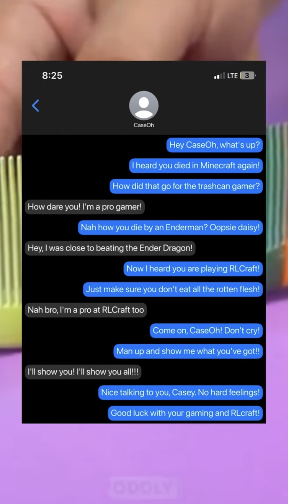
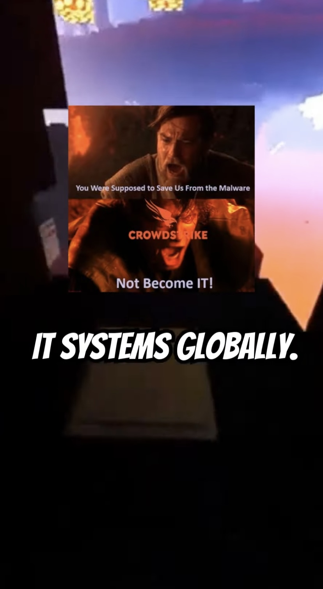

# AutoShorts - AI-powered Shorts Generator

AutoShorts is a fully fledged package that generates shorts videos with the help of AI to write the script. It can generate popular types of video seen on YouTube Shorts and TikTok.
 
If you want to support the development of this package, consider buying me a coffee:

[](https://ko-fi.com/shafilalam)

Your support will help me to continue the development of this package. Thank you!

> [!WARNING]
> The package author is not responsible for any misuse of the package, any content generated by the package, and any loss arising from the use of the package. Use at your own risk. Package is subject to change and may have breaking changes in the future. Not meant for production usage.

# Introduction

The package is built with a flexible abstraction layer which allows you to quickly create different types of videos with different AI tools and can be easily extended to include more types and tools internally.

This repo includes a CLI interface and JS interface. The CLI interface is built on top of the JS interface. The JS interface is the core of the package and can be used to generate videos programmatically.

**GUI interface is coming soon.**

> [!NOTE]
> This package is in the early stages of development and may have bugs - especially when interacting with AI to generate scripts. This package is not meant to be used in production environments yet. Since AI output is unpredictable, work is being done to make the output more predictable and controllable. If the AI generates an incorrect JSON output, then you can manually edit the JSON output to fix the issue. This package is subject to change and may have breaking changes in the future. Use at your own risk.

# Features
You can generate popular types of short videos seen on YouTube Shorts and TikTok like:
- Text-to-Speech (TTS) videos
- Topic-based videos with images
- Text message story videos
- 'Would you rather' videos
- Ranking item videos
- And more...

The topic-based video type can be used to generate videos on a wide range of topics like:
- News-related videos
- Educational videos
- Fun facts videos
- And more...

| Text Message Video | News Video | Quiz Video | Rank Video | Would You Rather Video |
| --- | --- | --- | --- | --- |
|  |  |  |  |  |

You can request new video types and tools to be added to the package by creating an issue on the GitHub repo.

# Installation

Note: By default, the package use Ollama to generate scripts. Therefore a working Ollama installation is required. It is recommended to use the `llama3.1` model for best results. You can install this model by running the following command: `ollama pull llama3.1`. Using other local models may result in incorrect output. You can use other AI APIs such as OpenAI ChatGPT 4o, Google Gemini AI, and Anthropic Claude by providing the necessary API keys.

## For JS Interface
```bash
# Install the package
npm install auto-shorts

# Download the necessary resources (to './res' folder by default)
npx auto-shorts --download
```

## For CLI Interface (global installation)
```bash
# Install the package globally
npm install -g auto-shorts

# Download the necessary resources (to './res' folder by default)
npx auto-shorts --download
```

# Example (CLI Interface)

Note: Since LLMs can hallucinate and are not deterministic, the videos may not generate the expected output. You can manually edit the JSON output to fix the issue.

```bash
# Install the package globally
npm install -g auto-shorts

# Download the necessary resources (to './res' folder by default)
npx auto-shorts --download

# Generate a video with AI (will find the necessary resources in the './res' folder)
# You have options to use different AI tools to generate the script, voice, and image

# Use OpenAI gpt-4o-mini to generate the script, ElevenLabs to generate the voice, and Pexels to generate the image
npx auto-shorts -p "make a news short about TypeScript" --aiType OpenAIGen --ttsType ElevenLabs --imageType PexelsImageGen --elevenLabsAPIKey YOUR_ELEVENLABS_API_KEY --pexelsAPIKey YOUR_PEXELS_API_KEY --openaiAPIKey YOUR_OPENAI_API_KEY

# Use local Ollama llama3.1 to generate the script, Built-in TTS to generate the voice, and Google Scraper to generate the image (default, no need to provide API keys)
npx auto-shorts -p "make a news short about TypeScript"
```

You can also run the command interactively and provide the necessary information when prompted:
```bash
npx auto-shorts
```

For help:
```bash
npx auto-shorts --help
```

# Example (JS Interface)

Note: You will need to download the necessary resources before running the code. You can do this by running the following command:
```bash
npx auto-shorts --download [path]
```

## AI-Generated Video
```javascript
const task = await genVideoWithAI(
    "make a news short about TypeScript", // Provide the prompt
    AIGenType.OpenAIGen, // Use OpenAI to generate the script
    { 
        tempPath: 'video_temp', // Provide the path to the temporary video folder
        resPath: 'res', // Provide the path to the downloaded resources folder
        voiceGenType: VoiceGenType.ElevenLabsVoice, // Use ElevenLabs to generate the voice
        imageGenType: ImageGenType.PexelsImageGen, // Use Pexels to generate the image
        apiKeys: {
            elevenLabsAPIKey: process.env.ELEVENLABS_API_KEY, // Provide the ElevenLabs API key
            pexelsAPIKey: process.env.PEXELS_API_KEY, // Provide the Pexels API key
        }
    }, 
    process.env.OPENAI_API_KEY // Provide the OpenAI API key
);

task.on('log', (log) => {
    console.info(log);
});

task.on('done', (output) => {
    console.info("--> Video generation complete! Video saved at: " + output);
});
```

## Manual Video
```javascript

/** @type {import("auto-shorts").VideoDataType} */
const data = {
    type: "topic",
    title: "TypeScript",
    description: "TypeScript is a programming language...",
    start_script: "Hello! Today we will be talking about TypeScript.",
    end_script: "That's all for today. Thanks for watching!",
    images: ["typescript logo"]
};

const task = await genVideoWithJson(
    data, {
    tempPath: 'video_temp',
    resPath: 'res',
    voiceGenType: VoiceGenType.ElevenLabsVoice,
    imageGenType: ImageGenType.GoogleScraperImageGen,
    apiKeys: {
        elevenLabsAPIKey: process.env.ELEVENLABS_API_KEY,
        pexelsAPIKey: process.env.PEXELS_API_KEY,
    }
});

task.on('log', (log) => {
    console.log(log);
});

task.on('done', (output) => {
    console.info("--> Video generation complete! Video saved at: " + output);
});
```

# API Keys

This package uses AI tools like OpenAI and ElevenLabs to generate scripts and images. You need to provide the API keys for these tools to use this package.

You need to provide the following API key depending on what tools you want to use:
- ElevenLabs API Key
- Pexels API Key
- Neets.ai API Key
- OpenAI API Key 

Make sure to provide the API keys in the environment variables with a package like `dotenv`.

# Contributing

If this package is missing any video types or AI tools that you would like to see, feel free to create an issue on the GitHub repo. You can also contribute to the package by creating a pull request to add new video types or AI tools.

# Layout

The package is structured as follows:
- `src`: Contains the source code for the package
- `example`: Contains example code to use the package
- `test`: Contains test code for the package
- `packages`: Contains the internal dependencies for the package (forked versions of `ffcreator` and `inkpaint`)

# Todo
- [ ] Add GUI
- [ ] Fix logging
- [ ] Make AI output structured for local LLMs (gpt4, gemini, claude are fine)
- [ ] Add more video types (Twitter/X posts, Reddit posts, etc.)
- [ ] Add Docker support
- [ ] Add more AI tools (e.g., OpenAI, Neets.ai, AI Image Generators, etc.)
- [ ] Add more customization options (custom fonts, colors, images, etc.)
- [ ] Add more error handling
- [ ] Add more tests
- [ ] Add more documentation
- [ ] Add support for more general video generation (e.g., long-form videos)
- [ ] Fix external dependencies vulnerabilities (only on dev dependencies)

## Star History

[](https://star-history.com/#alamshafil/auto-shorts&Date)

**By Shafil Alam.**
