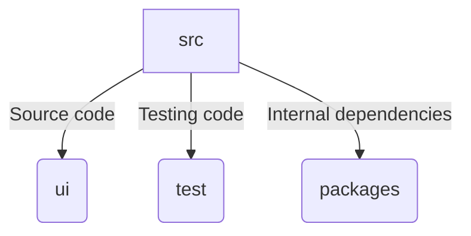

# Contributing

If this package is missing any video types or AI tools that you would like to see, feel free to create an issue on the GitHub repo. You can also contribute to the package by creating a pull request to add new video types or AI tools.

# Project Layout

The package is structured as follows:
- `src`: Contains the source code for the package
- `ui`: Contains the GUI code for the package
- `test`: Contains test code for the package
- `packages`: Contains the internal dependencies for the package (forked versions of `ffcreator` and `inkpaint`)

